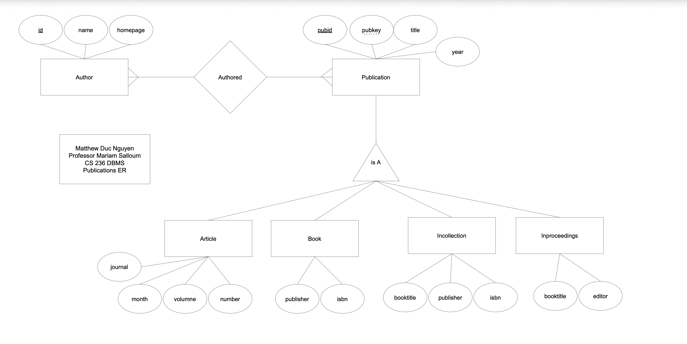

# Data Analytics Pipeline
### This project creates a relationational database for Publications as follows:

#### Publication Schema for this database is defined in createPubSchema.sql

### Queries for information in this database is in solution.sql
#### For Example:
`
-- Find insitutions that have published the most papers in STOC
-- Finding STOC Papers

select * from Publication where Publication.title like '%Symposium on Theory of Computing%' or Publication.title like '%STOC %' limit 20;
/*
 pubid  |              pubkey               |                                                           title                                                           | year  
---------+-----------------------------------+---------------------------------------------------------------------------------------------------------------------------+------
 3646057 | journals/siamcomp/Babai06         | Special Issue Dedicated To The Thirty-Sixth Annual ACM Symposium On Theory Of Computing (STOC 2004).                      | 2006
 3739118 | conf/stoc/2001                    | Proceedings on 33rd Annual ACM Symposium on Theory of Computing, July 6-8, 2001, Heraklion, Crete, Greece                 | 2001
 3956416 | journals/rc/LongpreB97            | Interval and Complexity Workshops Back-to-Back with 1997 ACM Symposium on Theory of Computing (STOC'97).                  | 1997
 3967150 | journals/siamcomp/DaskalakisKI18  | Special Section on the Forty-Seventh Annual ACM Symposium on Theory of Computing (STOC 2015).                             | 2018
 4202135 | conf/stoc/STOC18                  | Proceedings of the 18th Annual ACM Symposium on Theory of Computing, May 28-30, 1986, Berkeley, California, USA           | 1986
 4092385 | conf/iccal/Gillard90              | A Tiny Tool for Matrix Inversion in a COSTOC Environment.                                                                 | 1990
 4060244 | conf/stoc/2005                    | Proceedings of the 37th Annual ACM Symposium on Theory of Computing, Baltimore, MD, USA, May 22-24, 2005                  | 2005
 7226420 | conf/stoc/STOC9                   | Proceedings of the 9th Annual ACM Symposium on Theory of Computing, May 4-6, 1977, Boulder, Colorado, USA                 | 1977
 4308944 | conf/stoc/STOC26                  | Proceedings of the Twenty-Sixth Annual ACM Symposium on Theory of Computing, 23-25 May 1994, Montréal, Québec, Canada     | 1994
 4522194 | conf/stoc/STOC25                  | Proceedings of the Twenty-Fifth Annual ACM Symposium on Theory of Computing, May 16-18, 1993, San Diego, CA, USA          | 1993
 5198036 | conf/stoc/2000                    | Proceedings of the Thirty-Second Annual ACM Symposium on Theory of Computing, May 21-23, 2000, Portland, OR, USA          | 2000
 5212094 | journals/siamcomp/SmithK18        | Special Section on the Forty-Sixth Annual ACM Symposium on Theory of Computing (STOC 2014).                               | 2018
 5340587 | conf/stoc/2009                    | Proceedings of the 41st Annual ACM Symposium on Theory of Computing, STOC 2009, Bethesda, MD, USA, May 31 - June 2, 2009  | 2009
 5390032 | journals/siamcomp/AaronsonGKMMS09 | Special Issue On The Thirty-Eighth Annual ACM Symposium On Theory Of Computing (STOC 2006).                               | 2009
 5661068 | conf/stoc/2002                    | Proceedings on 34th Annual ACM Symposium on Theory of Computing, May 19-21, 2002, Montréal, Québec, Canada                | 2002
 5732504 | conf/stoc/STOC15                  | Proceedings of the 15th Annual ACM Symposium on Theory of Computing, 25-27 April, 1983, Boston, Massachusetts, USA        | 1983
 5732511 | conf/stoc/1999                    | Proceedings of the Thirty-First Annual ACM Symposium on Theory of Computing, May 1-4, 1999, Atlanta, Georgia, USA         | 1999
 5768216 | conf/stoc/STOC11                  | Proceedings of the 11h Annual ACM Symposium on Theory of Computing, April 30 - May 2, 1979, Atlanta, Georgia, USA         | 1979
 6229886 | conf/stoc/STOC27                  | Proceedings of the Twenty-Seventh Annual ACM Symposium on Theory of Computing, 29 May-1 June 1995, Las Vegas, Nevada, USA | 1995
 6706244 | journals/siamcomp/AllenderKS09    | Special Section On The Thirty-Ninth Annual ACM Symposium On Theory Of Computing (STOC 2007).                              | 2009
(20 rows)
`